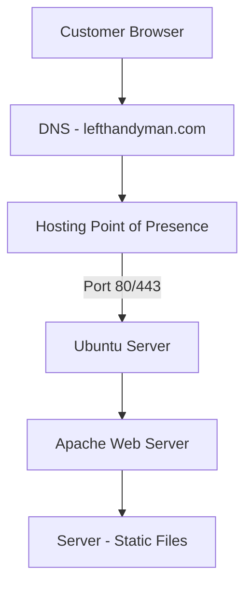

```mermaid
graph TD;
    A[Customer Browser] --> B[DNS - lefthandyman.com];
    B --> C[Hosting Point of Presence];
    C -->|Port 80/443| D[Ubuntu Server];
    D --> E[Apache Web Server];
    E --> F[Server - Static Files];
```
